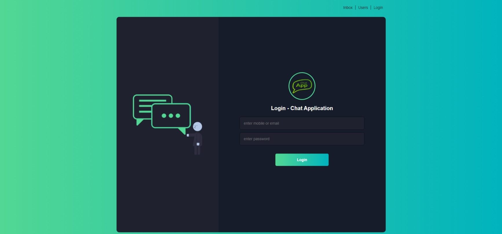

# Chat Application

This is a live chat application developed using Node.js, Express.js, EJS, MongoDB, Mongoose, Socket.io, and custom authentication with JSON Web Tokens (JWT).



## Table of Contents

- [Features](#features)
- [Installation](#installation)
- [Usage](#usage)
- [Testing](#testing)
- [License](#license)

## Features

- Simultaneous live chat between multiple users.
- Server-side development using Node.js and Express.js.
- EJS templates for dynamic rendering of HTML views.
- MongoDB as the database for storing user information and chat messages.
- Mongoose for modeling the database and handling data interactions.
- Concurrent duplex connections between users achieved using Socket.io.
- Custom authentication implemented with pure Node.js by generating JSON Web Tokens (JWT).

## Installation

To install and run this application locally, please follow these steps:

1. Clone the repository to your local machine:

   ```bash
   git clone https://github.com/hr-sobuj/chat-application.git
   ```

2. Navigate to the project directory:

   ```bash
   cd chat-application
   ```

3. Install the dependencies:

   ```bash
   npm install
   ```

## Installation

To install and run this application locally, please follow these steps:

1. Clone the repository to your local machine:

   ```bash
   git clone https://github.com/your-username/live-chat-application.git
   ```

2. Navigate to the project directory:

   ```bash
   cd live-chat-application
   ```

3. Install the dependencies:

   ```bash
   npm install
   ```

4. Set up the environment variables:

   - Create a `.env` file in the project root directory.
   - Add the following variables to the `.env` file:

     ```bash
     APP_NAME=Live Chat Application
     APP_URL=http://localhost:3000
     PORT=3000
     MONGODB_CONNECTION_STRING_OLD=your-previous-mongodb-connection-string
     MONGODB_CONNECTION_STRING=your-mongodb-connection-string
     MONGODB_USERNAME=your-mongodb-username
     MONGODB_PASSWORD=your-mongodb-password
     JWT_SECRET=your-jwt-secret
     JWT_EXPIRE_TOKEN=3600
     COOKIE_NAME=your-cookie-name
     COOKIE_SECRET=your-cookie-secret
     ```

     Replace the placeholders with the appropriate values for your setup.

     - `APP_NAME`: The name of your live chat application.
     - `APP_URL`: The URL where your application will be hosted.
     - `PORT`: The port number on which the server will run.
     - `MONGODB_CONNECTION_STRING_OLD`: The previous MongoDB connection string (if applicable).
     - `MONGODB_CONNECTION_STRING`: The MongoDB connection string for your database.
     - `MONGODB_USERNAME`: The username for accessing your MongoDB database.
     - `MONGODB_PASSWORD`: The password for accessing your MongoDB database.
     - `JWT_SECRET`: A secure secret key for JSON Web Tokens (JWT).
     - `JWT_EXPIRE_TOKEN`: The expiration time for JWT tokens (in seconds).
     - `COOKIE_NAME`: The name of the cookie for session management.
     - `COOKIE_SECRET`: A secure secret key for cookie encryption.

5. Start the application:

   ```bash
   npm start
   ```

6. Open your web browser and navigate to `http://localhost:3000` to access the live chat application.

## Usage

- Upon accessing the application, users can sign up using their email and password or log in if they already have an account.
- Once logged in, users will be able to see the chat interface and interact with other users in real-time.
- Users can send messages in the chat window and view messages from other participants.
- The chat history is stored in the MongoDB database and can be accessed even after logging out and logging back in.

## Testing

To test the application, use the following credentials:

- Email: admin@gmail.com
- Password: Admin1,1

Use the provided credentials to log in and test the various features and functionalities of the live chat application.

## License

This project is licensed under the [MIT License](LICENSE). Feel free to use and modify the code as per your needs.

```

```
